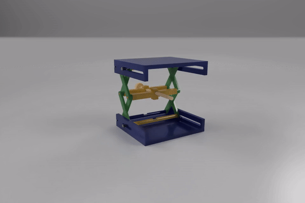
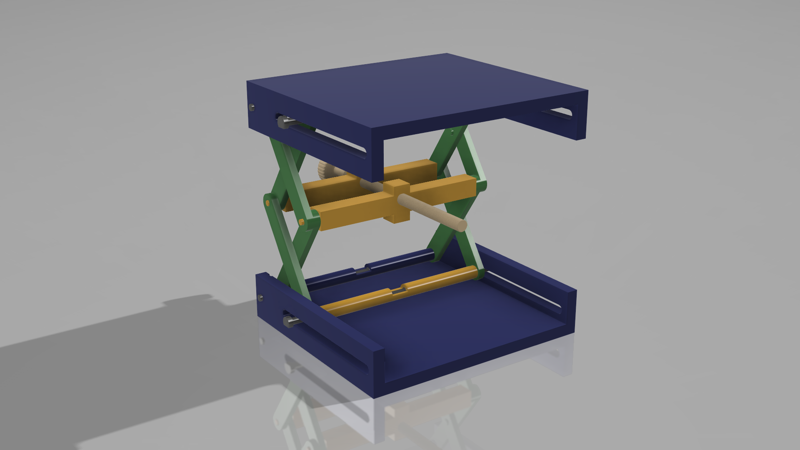
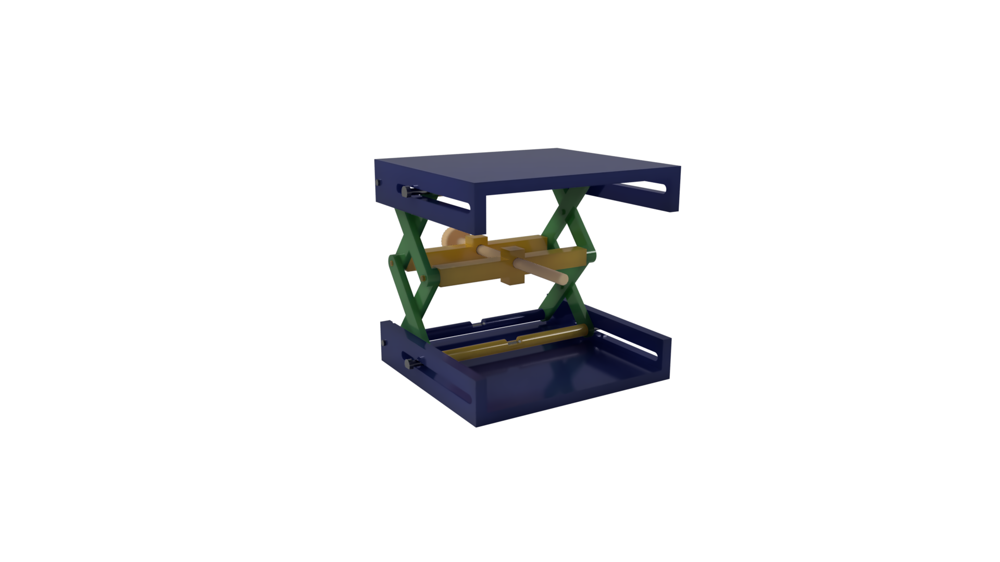
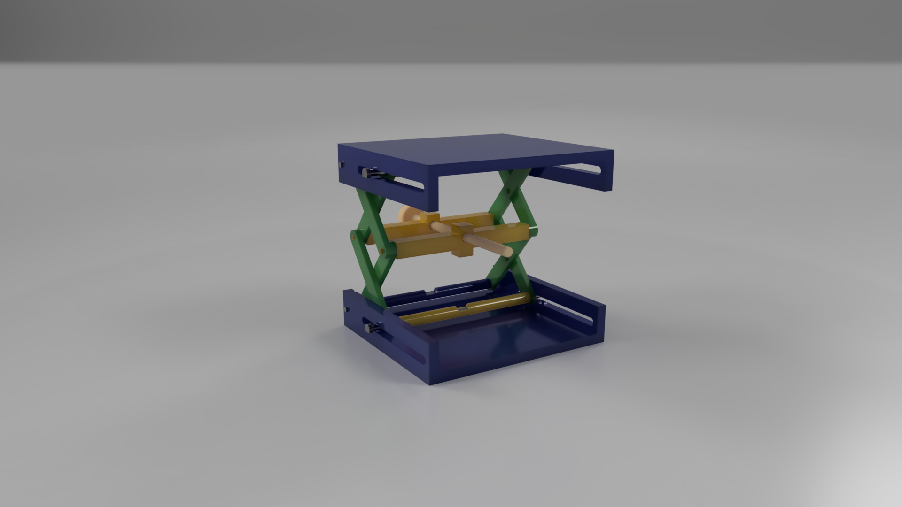

# Name: Scissor Lift Mechanism
Oficial Author: intentional3D (http://www.intentional3d.com) /// (https://www.thingiverse.com/thing:925556)

Remake Author: Filip Razvan Adrian
Public Link latest version Fusion 360 Web: https://a360.co/3oQdq2M
## Scissor lifts are a type of mechanism that allows for vertical displacement of some load, through the use of linked, folding supports, in a crisscross “X” pattern, referred to as a pantograph (or, simply, a scissor mechanism). Scissor lifts are widely used in industrial applications, and also form a staple design element in competitive robotics.

### The Mechanism is driven by a manually operated screw.
Main Components: 
1) Lower&Upper Left&Right Arms
2) Lower&Upper Base
3) Middle Base
4) Screw

Checkpoint 1: Create Base+arms

Checkpoint 2: Mirror base+arms and assembly

Checkpoint 3: Add Joints + motion study

Final Project: Minor edits + appearance + render

For Fusion360 app you will need to run the Motion Study.

#### Existing Files: .f3d , .stl , .png , .gif , .mp4

Software used for develop & render: Fusion 360.

